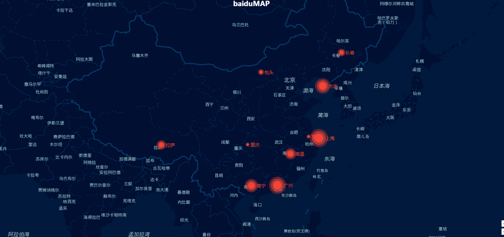

# baiduMap背景介绍
页面根据UI设计显示相应的配色的地图。并在地图上进行动态点的绘制，根据点的坐标确定最优的地图的放大等级和中心点。
是一个比较简单的demo，最大的难处是百度地图的配色，在此我根据地图的不同等级进行了不同的底色调配，其他功能可根据地图和echarts官网查询相应的api
完成相应的功能

### 截图事例

### 使用方法
以上代码均为开源代码，下载既可在浏览器进行查看。如果能对你有略微的帮助，请给颗爱心，谢谢。
